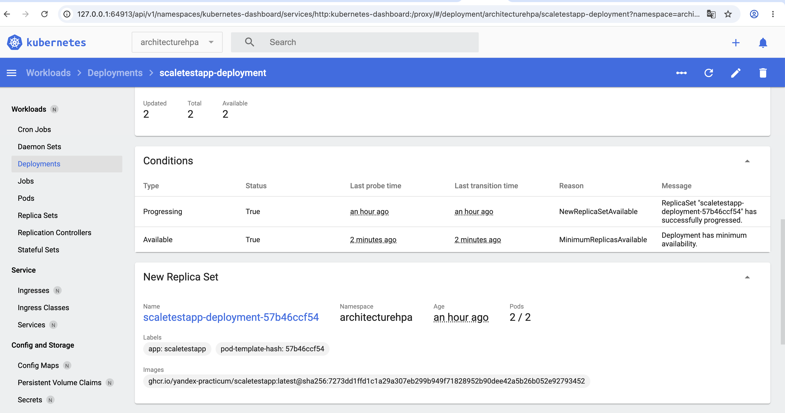
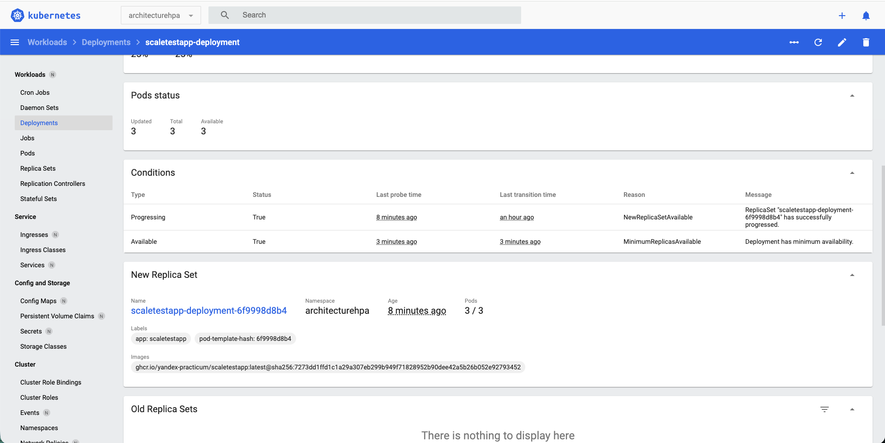

## Задание 2. HPA

## Запуск и конфигурация minikube

1. запуск
```bash
minikube start --driver=docker
```

2. Создание неймспейса
```bash
kubectl create namespace architecturehpa
```

3.  Добавление сервера метрик
```bash
minikube addons enable metrics-server
```

4. Запуск дашборда
```bash
minikube dashboard
```

## Подготовка сервисов

1. Загрузка образа сервиса scaletestapp
```bash
eval $(minikube docker-env)

docker pull ghcr.io/yandex-practicum/scaletestapp:latest@sha256:7273dd1ffd1c1a29a307eb299b949f71828952b90dee42a5b26b052e92793452
```

2. [Манифест деплоймента](app-deployment.yaml)
3. [Манифест cервиса для деплоймента](app-service.yaml) . Используем Loadbalancer + tunnel
4. [Манифест HPA](hpa.yaml)
5. Далее открываем отдельный терминал и выполняем 
```bash
minikube tunnel
```
6. Проверяем, что запрос работает:
```bash
curl http://127.0.0.1:8080/
```

## Запуск НТ

[Файл с нагрузкой](locustfile.py)
```bash
locust
```

## Результаты НТ

HPA успешно заскейлил под





```
task2 gmbocharov$ sudo kubectl top pods -n architecturehpa
NAME                                       CPU(cores)   MEMORY(bytes)   
scaletestapp-deployment-6f9998d8b4-jrtlj   1m           10Mi            
scaletestapp-deployment-6f9998d8b4-nn29r   19m          17Mi            
scaletestapp-deployment-6f9998d8b4-pnhqw   20m          18Mi     
```