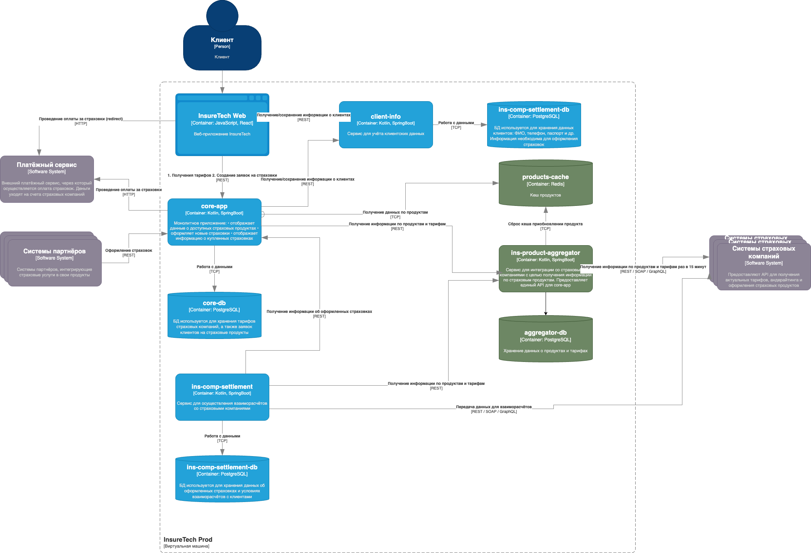
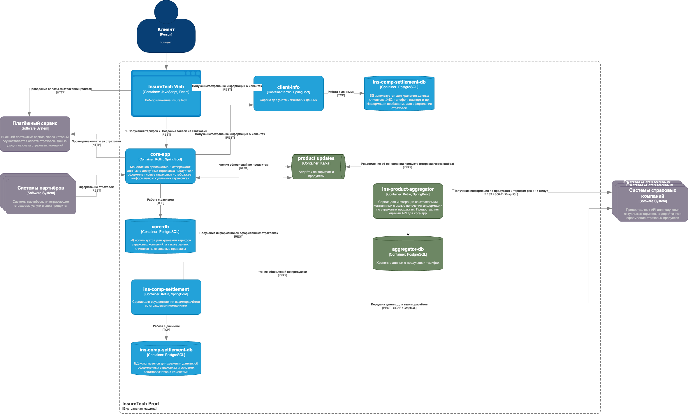

# Задание 3. Переход на Event-Driven архитектуру

## Проблемы текущего решения

1) ins-product-aggregator в рамках одного синхронного запроса запрашивает весь список компаний. Все это время клиент ожидает получения ответа.
2) core-app и ins-comp-settlement хранят у себя одну и ту же информацию
3) каждый под core-app запрашивает данные раз в 15 минут, тк реплика локальная => больше нагрузка на агрегатор

## Риски
1) Данные по всем продуктам передаются в одном запросе, его размер линейно растет с ростом партнеров
2) Долгое время ожидания ответа, больше вероятность разрыва соединения
3) При ретрае все данные будут снова запрошены у партнеров
4) Оверхед на хранение одинх и тех же данных в core-app и ins-comp-settlement
5) Риск неконсистентности продуктов - отставание от сервиса партнера на 15 минут
6) при падении или создании нового пода core-app , ins-comp-settlement приходится запрашивать все данные по продуктам, тк теряется локальное состояние 
   

## Переход на Event-Driven архитектуру

Главный плюс перехода на Event-Driven - устранение лишних запросов между core-app, ins-comp-settlement и аггрегатором. 
Возможно два вариатна перехода

### Вариант 0 - переход на уведомления от партернов.
В текущем решении используется стратегия поллинга партнерских сервисов. Это повышает нагрузку на них и ведет к отставанию продуктов InsureTech на период запроса.

Идеальный вариант:
 - **партнерские сервисы публикуют в Kafka уведомления об изменении продукта**
 - получив уведомление, аггрегатор запрашивает по rest api полную мету этого сервиса. Также можно получать сразу полную мету продукта из Kafka топика партнера, в этом случае повторный запрос будет не нужен. 

Если этот вариант невозможен (партнеры редко выставляют kafka топики с обновлением сущностей), предлагается реализовать поллинг партнеров на стороне агрегатора и сохранение данных о продуктах также в базу агрегатора. 

### Вариант 1. Aggregator поллит партнеров

В этом варианте решения аггрегатор
1) заводит свою базу данных, в которой будут храниться данные по продуктам. 
2) выставляет апи для запроса продуктов (из своей базы)
3) заводит независимые крон джобы, использует редис или блокировку на базе для выбора пода, который совершит запрос. Каждая джоба раз в 15 минут опрашивает одного партнера.
4) полученные данные сохраняются в бд, при этом можно использовать базу, оптимизрованную под чтение. Как вариант использовать scylla
5) core-app и ins-comp-settlement используют rest api для получения нужных данных по продуктам
6) для core-app можно применить кеширование, а кеш инвалидировать при получении новых данных от партнера. 

### Вариант 2. Оставляем данные по продуктам и тарифам в core-app и ins-comp-settlement

В этом варианте решения аггрегатор также собирает в свою базу данные партнеров посредство поллинга, но отправляет уведомления об их изменении в Кафка-топик. Апдейты отправляются с использованием паттерна Transaction Outbox.

Core-App и ins-comp-settlement читают топик и обновляют данные в своей базе.

